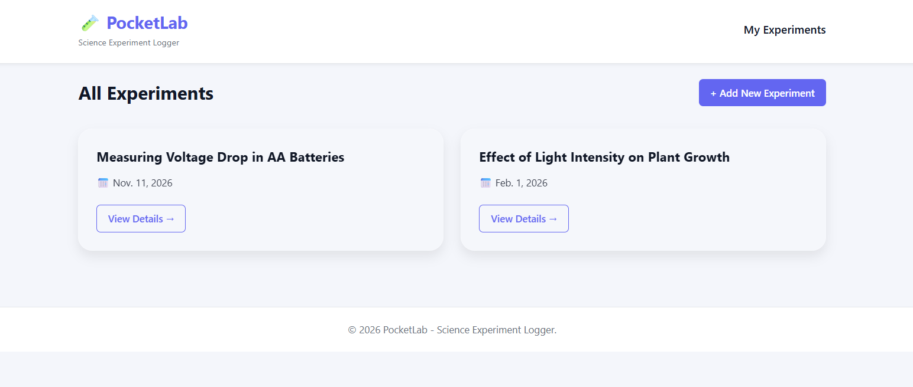
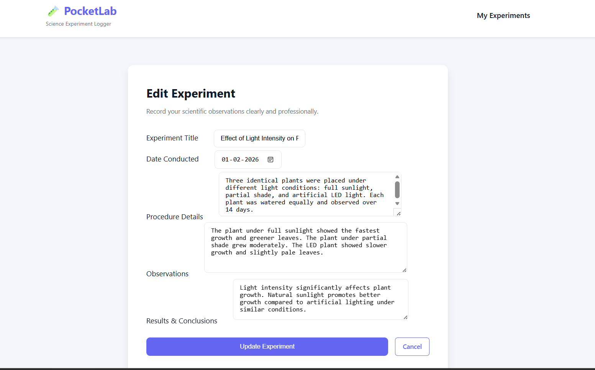
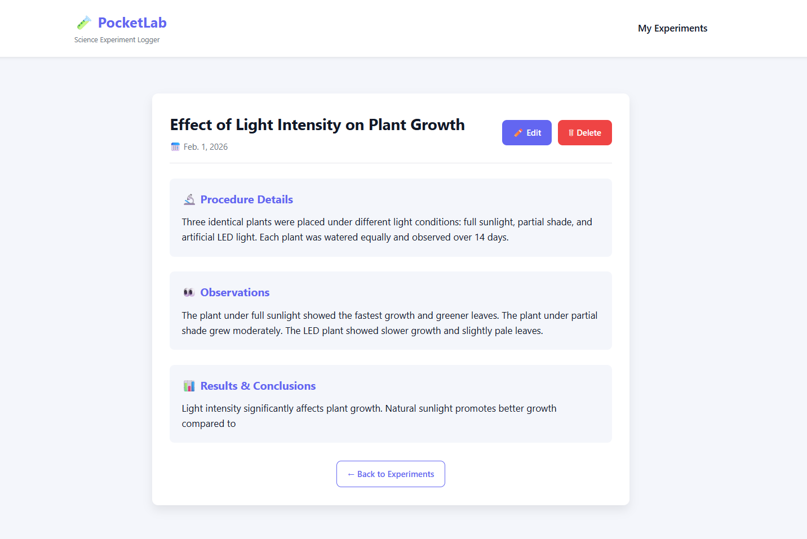
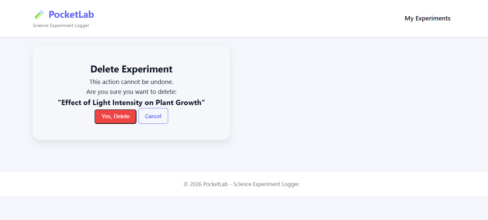

# 🧪 PocketLab – Experiment Logger

PocketLab is a modern Django-based web application that allows users to log, manage, and track scientific experiments in a clean and interactive glass-style interface.

---

## 🚀 Features

- Create new experiments
- Edit and update logs
- Delete experiments safely
- View detailed experiment reports
- Responsive glassmorphism UI
- Clean dashboard-style layout

---

## 🛠 Tech Stack

- Python 3
- Django
- HTML5
- CSS3
- Git & GitHub

---

## 📸 Screenshots

### 📋 Experiment Dashboard


### ➕ Add Experiment Form


### 🔍 Experiment Detail View


### ⚠️ Delete Confirmation


---

## 💻 How to Run This Project Locally

Follow these steps to set up and run the project on your PC.

---

### 1️⃣ Clone the Repository

```bash
git clone https://github.com/shashi-7141/PocketLab.git
cd PocketLab
```

---

### 2️⃣ Create a Virtual Environment

```bash
python -m venv venv
```

Activate it:

**Windows:**
```bash
venv\Scripts\activate
```

**Mac/Linux:**
```bash
source venv/bin/activate
```

---

### 3️⃣ Install Dependencies

If `requirements.txt` exists:

```bash
pip install -r requirements.txt
```

If not:

```bash
pip install django
```

---

### 4️⃣ Apply Database Migrations

```bash
python manage.py migrate
```

---

### 5️⃣ Run the Development Server

```bash
python manage.py runserver
```

Open your browser and go to:

```
http://127.0.0.1:8000/
```

🎉 The project should now be running locally!

---

## 🧠 Future Improvements

- User authentication system
- Search & filtering
- Experiment categories
- Deployment to cloud (Render / AWS)
- REST API integration

---

## 👨‍💻 Author

Shashi  
IT Student | Django Developer | UI Enthusiast  

---

⭐ If you like this project, consider giving it a star!
